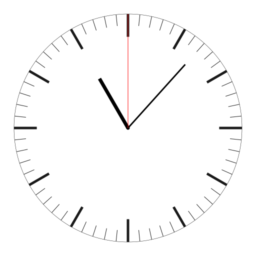
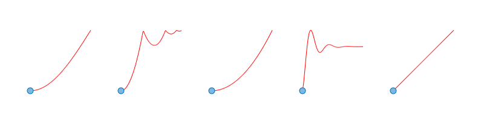

# DynFigure

Create some programmable animations in Python. Inspired by TikZ and D3.js with exporters for MP4 and GIF.


```python
from dynfigure import *
from dynfigure.elements import *

# create a camera to render the scene
camera = camera.Camera2D()

# change the default coordinate system
with CoordinateSystem(xscale=2, yscale=2):
    scene = Scene()
    # create a circle at position (0, 10) with radius 50 and some style
    scene.put(Circle((0, 10), 50, style=Style('red', 'red!0.5!white')))
    # you can create a reference object to move it later
    c = Circle((0, 10), '50px', style=Style('red', 'red!0.5!white'))
    c.position = [0, 15]
    scene.put(c)
    # and draw a line
    scene.put(Line([100, 100], [150, 150], style=Style('red', 'red!0.5!white')))
    # include some external images
    scene.put(Image('debug.png'))

    # a final render of the scene
    camera.render(scene).save('test.png')
```

# Examples

See examples





Additional examples are VQ, PQ, PQT.

# Usage

```console
user@host $ export PYTHONPATH=/path/to/github.com/patwie/dynfigure:${PYTHONPATH}
user@host $ dir /path/to/github.com/patwie/dynfigure
dynfigure exmaples README.md
```